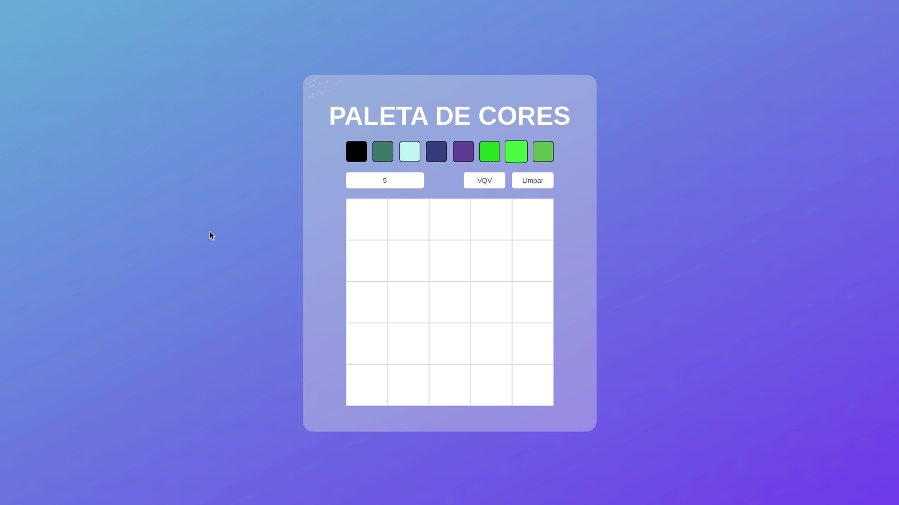

# Pixel-art Board
Esse foi o meu 3º projeto feito na Trybe, basicamente é um quadro (grid) com vários quadradinhos, que podem ser pintados por uma das cores disponiveis na barra de paletas de cores.

## Algumas das implementações
- Tamanho do quadro pode ser escolhido pelo usúario
- Cores são geradas automaticamente
- Um botão que ao ser clicado limpa o quadro
- Função de segurar o botão esquerdo do mouse e pintar vários quadros continuamente
